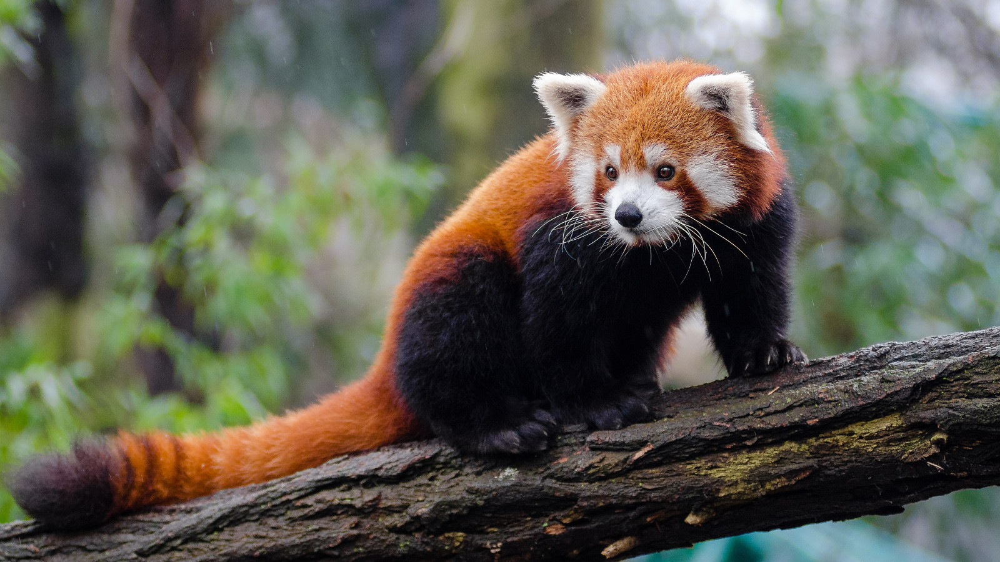

_From Wikipedia_

The red panda (Ailurus fulgens), also known as the lesser panda, is a small
mammal native to the eastern Himalayas and southwestern China. It has dense
reddish-brown fur with a black belly and legs, white-lined ears, a mostly white
muzzle and a ringed tail. Its head-to-body length is 51–63.5 cm (20.1–25.0 in)
with a 28–48.5 cm (11.0–19.1 in) tail, and it weighs between 3.2 and 15 kg (7.1
and 33.1 lb). It is well adapted to climbing due to its flexible joints and
curved semi-retractile claws.

## Etymology

The origin of the name panda is uncertain, but one of the most likely theories
is that it derived from the Nepali word "ponya". The word पञ्जा pajā or पौँजा
pañjā means "ball of the foot" and "claws". The Nepali words "nigalya ponya" has
been translated as "bamboo footed" and is thought to be the red panda's Nepali
name; in English, it was simply called panda, and was the only animal known
under this name for more than 40 years; it became known as the red panda or
lesser panda to distinguish it from the giant panda, which was formally
described and named in 1869.

## Description

The red panda's coat is mainly red or orange-brown with a black belly and legs.
The muzzle, cheeks, brows and inner ear margins are mostly white while the bushy
tail has red and buff ring patterns and a dark brown tip. The colouration
appears to serve as camouflage in habitat with red moss and white lichen-covered
trees. The guard hairs are longer and rougher while the dense undercoat is
fluffier with shorter hairs. The guard hairs on the back have a circular
cross-section and are 47–56 mm (1.9–2.2 in) long. It has moderately long
whiskers around the mouth, lower jaw and chin. The hair on the soles of the paws
allows the animal to walk in snow.
